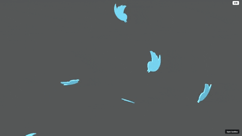

# aframe-vue-twitter-storm

A 3D storm of spinning Twitter logos, rendered in the browser with
[A-Frame](https://aframe.io/) (WebVR/WebGL) and Vue.js.

**Live demo:** <https://jeromegraves.com/aframe-vue-twitter-storm/>



## Run

```bash
npm install
npm run dev       # Vite dev server (hot reload)
npm run build     # production build to dist/
npm run preview   # preview the production build
```

Stack: Vue 3 + A-Frame, built with Vite.

## Credits

3D model: <https://sketchfab.com/3d-models/twitter-logo-60aedf8d974d481995e196225fb0bd2e>. Free to reuse.

## License

MIT — see [`LICENSE`](LICENSE).
